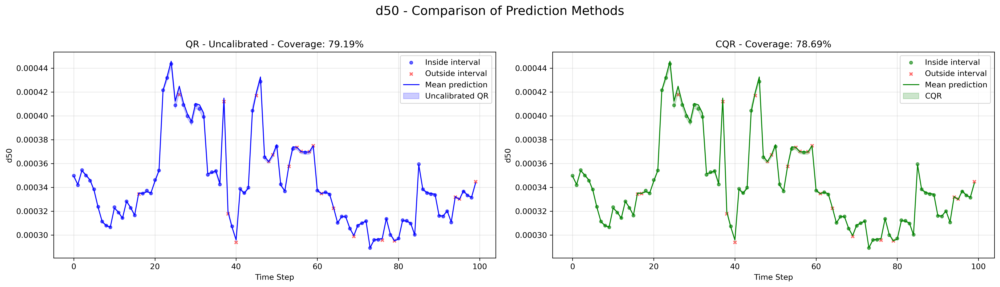
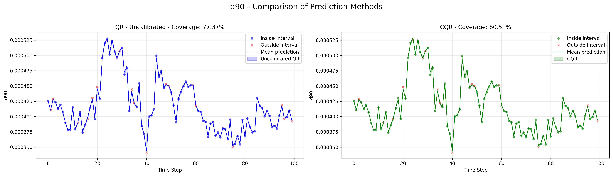
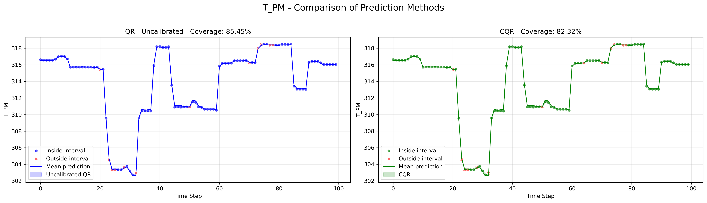

# ML-Based Modeling of Chemical Reactor Dynamics

This project implements a pipeline to cluster and model time-series data from a chemical reactor for forecasting key reactor state variables using deep learning. It includes multiple models, including the currently accepted best model based on test evaluations, a Bidirectional LSTM-based model with multiple heads.

---

## Project Structure

```
project_release/
|├── Data/
|   └── clustered/          # Clustered batch files (e.g., cluster0/)
|
|├── tools/
|   ├── models/
|   |   └── ANN/
|   |       └── narx_model.py   # Original NARX model
|   ├── train.py              # Main training pipeline (cluster-specific)
|   ├── preprocessing/         # Scripts for data cleaning and clustering
|   └── tuning/
|       ├── run.py             # CLI-enabled train script for tuning
|       ├── tune.py            # Runs grid search with subprocess
|       ├── model.py           # BiLSTM multihead model
|       └── results/
|           └── run_<id>/      # Outputs per tuning run
|
└── README.txt
```

---

## Installation & Setup

1. Create a virtual environment and install requirements:

```bash
conda create -n MLME-Lab python=3.9
conda activate MLME-Lab
pip install -r requirements.txt
```

The important packages to be installed are
- python=3.9
- numpy==2.0.2
- pandas==2.3.0
- matplotlib==3.9.4
- plotly=6.1.2
- graphviz==0.21
- hdbscan=0.8.39
- pytorch==2.5.1
- torchaudio==2.5.1
- torchvision==0.20.1
- torchviz==0.0.3
- scikit-learn==1.6.1
- scipy==1.13.1


2. Ensure data is present under `Data/file_<batch_id>.txt`

---

## Clustering

**⚠️ IMPORTANT:**  Do this step before training a model

To cluster the data present in `Data/`:

```bash
cd tools/preprocessing/clustering/
python clustering.py
```

This will cluster the data and seggregate the clustered data files in their own respective directories under `Data/clustered/cluster<id>/file_<batch_id>.txt`

## Training a Model

To train the BiLSTM multihead model on a specific cluster:

```bash
cd tools
python train.py --cluster_id <id> --model <model_type> --epochs 30 --lr 5e-4 --batch_size 64 --window_size <size>
```

The CLI arguments include:

- cluster_id - choose the cluster id to perform training on
- train_all - write this instead of giving cluster_id to perform training on all clusters individually
- model - options for model types are "ann", "lstm", "stacked_lstm", "stacked_lstm_reg", "bilstm_attn", "bilstm_multihead"
- epochs - number of epochs
- lr - learning rate
- batch_size - number of input and output windows per batch
- window_size - number of timesteps to be considered as input in NARX architecture model
- log_scale - plots the y axis of loss graph in log scale
- log_hyperparams - logs hyperparameters of current training run in `results/hyperparameters.txt`, saves loss plot in `results/` else plots and shows results in terminal
- save_model - saves trained model in `results/`
- sm_filt - toggle smooth filtering for preprocessing
- test_saved_model - accepts run id as int and uses saved model by run_id to perform closed loop test evaluation
- open_loop_run - accepts run id as int and uses saved model for open loop test evaluation
- early_stopping - flag to early stop model when validation loss is stagnant
- early_stop_patience - Patience for early stopping, default 10
- test_zscore_filter - plots stages of z score filter and smoothing filter for all control states using current threshold and cutoff values in zscore_filter_trial function


if `--test_saved_model run_<id>` is used, model prediction visualization graphs will be stored in `results/run_<id>/`.

---

## Evaluating Model

The `train.py` script automatically evaluates the model after training a model:

- Closed Loop: via `evaluate_model()`

Results are saved under the run folder and optionally summarized in tuning logs.

To run more test evaluations on closed and open loop, invoke `train.py` script again using the following CLI arguments

```bash
cd tools
python train.py --cluster_id <id> --model <model_type> --window_size <size> --test_saved_model <run_id>
python train.py --cluster_id <id> --model <model_type> --window_size <size> --open_loop_run <run_id>
```

> 💡 **Note:**  
> `cluster_id`, `model` and `window_size` are mandatory CLI arguments based on the model trained previously. The window size can be inferred in `results/hyperparameters.txt` based on the model's `run_id`

---

## Hyperparameter Tuning

`tune.py` runs a grid search over defined parameter combinations for the `bilstm_multihead` model.

```bash
cd tools/tuning
python tune.py
```

The script:

- Runs `run.py` via subprocess for each config
- Logs performance in `results_summary.csv`
- Prints best run based on lowest average closed-loop MSE

To be run after `tune.py`,

`test.py` evaluates all model combinations on the Beat-the-Felix test file and stores evaluation results in `beat_the_felix_summary.csv`.

```bash
cd tools/tuning
python test.py
```

---

## Visualization

The vizualizations of predictions can be seen under `results/run_<id>/`. The current best performing model's `(run_id - 1752708457)` visualizations can be found in the same directory.

Here are the best performing model's graph and results

### Loss Curve

<p align="center">
  
</p>

### State-wise Predictions

<div>
<p align="center">
  
</p>

<p align="center">
  
</p>

<p align="center">
  
</p>

<p align="center">
  
</p>

<p align="center">
  
</p>

<p align="center">
  
</p>

</div>

### Test Evaluation Results

**Test Evaluation for Run ID: 1752708457**

<div align="center">

| State | Closed Loop MSE | Closed Loop MAE | Open Loop MSE | Open Loop MAE |
|-------|------------------|------------------|----------------|----------------|
| c     | 6.51e-08         | 2.15e-04         | 2.41e-06       | 1.18e-03       |
| T_PM  | 2.29e-02         | 1.13e-01         | 7.28e-01       | 6.54e-01       |
| d50   | 8.81e-13         | 7.40e-07         | 8.45e-10       | 2.40e-05       |
| d90   | 1.25e-12         | 8.86e-07         | 1.15e-09       | 2.89e-05       |
| d10   | 6.31e-13         | 6.15e-07         | 1.23e-09       | 2.96e-05       |
| T_TM  | 3.30e-02         | 1.21e-01         | 7.69e-01       | 6.73e-01       |


</div>


---


## Conformalized Quantile Regression (CQR)

CQR is applied **after training an ANN model** to generate uncertainty-aware prediction intervals. This approach uses quantile regressors to estimate prediction error bounds, then calibrates them using a conformal correction step on a separate calibration set.

---

### Usage

The script is located at:

```bash
tools/tuning/cqr_simple.py
```

To run the pipeline:

```bash
cd tools/tuning
python cqr_simple.py
```

It performs the following:
- Trains **quantile regressors** for lower and upper τ (default: 0.1 and 0.9)
- Computes **conformity correction factors** from calibration data
- Applies the correction to test predictions to yield **CQR intervals**
- Saves coverage plots for selected test batches

---

### CQR vs Uncalibrated Intervals (Example)

<div>

<p align="center">
  
</p>

<p align="center">
  
</p>

<p align="center">
  
</p>

<p align="center">
  
</p>

<p align="center">
  
</p>

<p align="center">
  
</p>

</div>

Each subplot compares:
- **Left:** Quantile Regression (QR) intervals before calibration
- **Right:** Conformalized QR (CQR) intervals with corrected coverage

---

### ✅ Output Summary

CQR improves prediction interval coverage from **under-confident QR** intervals to **well-calibrated bounds** that match the desired coverage level (e.g., 80%).

